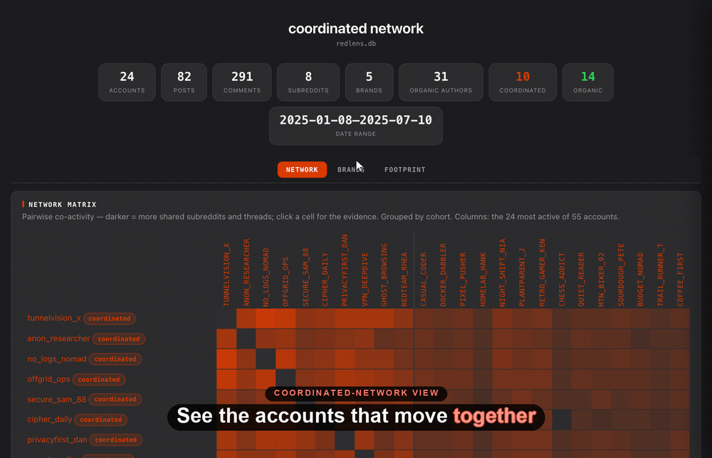

<h1 align="center">redlens</h1>

<p align="center">
  <strong>A local lens on public Reddit history — archive users and topics, analyze them, own the data.</strong>
</p>

<p align="center">
  <a href="https://github.com/TheWeiHu/redlens/actions/workflows/ci.yml"></a>
  <a href="https://github.com/TheWeiHu/redlens/blob/main/LICENSE"></a>
  <a href="pyproject.toml"></a>
  <a href="https://arctic-shift.photon-reddit.com"></a>
</p>

<p align="center">
  <a href="#how-it-works">How It Works</a>
  ·
  <a href="#install">Install</a>
  ·
  <a href="#commands">Commands</a>
  ·
  <a href="DESIGN.md">Design</a>
</p>

<p align="center">
  
</p>

<p align="center"><sub>The <code>serve</code> coordinated-network view on a synthetic astroturf network — not real data.</sub></p>

Archive and analyze public Reddit history, locally. redlens pulls from
[arctic-shift](https://arctic-shift.photon-reddit.com) — a free, keyless mirror — and keeps
everything in **one SQLite file you own**. No API keys, no setup, no Reddit account.

## How It Works

```
Archive    redlens sync <user>     a user's full public post + comment history
           redlens track <topic>   build a subreddit net, archive every match
Analyze    redlens show / topics   rollups, scores, per-subreddit totals
Network    redlens serve           the coordinated-network dashboard (matrix, brands, seeding)
Render     redlens page <topic>    a standalone, dependency-free HTML report
           redlens report          bake the network dashboard into one shareable HTML file
```

arctic has no global text search, so a **topic** isn't a query — it's a *net*. `track` discovers
the subreddits a topic lives in, archives every matching post across them, and remembers the net so
re-runs pull only what's new. The schema is created and migrated automatically on first use. Full
architecture and configuration in [`DESIGN.md`](DESIGN.md).

## Install

```bash
pip install -e ".[dev]"
```

Two runtime dependencies (`platformdirs`, `sqlmodel`), all permissively licensed (MIT/BSD/PSF).

## Commands

| Command | What it does |
| --- | --- |
| `redlens sync <user>` | Archive a user's public post + comment history |
| `redlens show <user>` | Print a rollup (`--json` for machine output) |
| `redlens list` | Every archived user — counts, last activity |
| `redlens export <user>` | Dump posts + comments (`--format json\|csv\|jsonl`, `-o PATH`) |
| `redlens track <topic>` | Build a subreddit net and archive every matching post |
| `redlens topics` | Every tracked topic — keywords, net size, match count |
| `redlens page <topic>` | Render a standalone HTML report (`--all` for every topic + index) |
| `redlens explore` | Browse the DB in your browser (read-only, with a SQL console) |
| `redlens serve` | Open the local listening report — a coordinated-network view (drill any account to its posts/comments) |
| `redlens report` | Bake that dashboard into one self-contained, shareable HTML file (no server); `--anon` pseudonymizes every account (`user-01`, …) to share without naming people |
| `redlens leads` | Score unlabeled accounts for cohort membership from deterministic signals (`--out` a promote-ready CSV) |
| `redlens brands` | Mine the cohort's brand roster and merge it into `brands.csv` (LLM-canonicalized with a key) |
| `redlens seeding` | Judge each roster brand seeded-vs-organic from deterministic signals (needs ≥2 labeled cohorts) |
| `redlens summarize <user>` | LLM-powered summary (needs an API key — see below) |
| `redlens setup` | Configure the optional LLM API key |
| `redlens completions <shell>` | Print a `bash\|zsh\|fish` completion script |

Run `redlens <command> --help` for flags. `track` takes `--query`/`--exclude` keyword steering,
`--sources` to pick the discovery net (`name`, `global`, `web`, `popular`, `llm`), `--comments` to
archive threads, and `--discover` to widen the net through matched authors.

Explore the network live with `serve`, then hand off a static copy anyone can open:

```bash
redlens serve --cohorts cohorts.csv --brands brands.csv   # live localhost dashboard
redlens report --cohorts cohorts.csv -o network.html      # same view, one shareable file
redlens report --cohorts cohorts.csv --anon -o public.html  # same file, accounts pseudonymized
```

## Optional LLM Key

An optional **OpenAI-compatible API key** powers `redlens summarize`, LLM-scored sentiment in
`page --summary`, and the `llm` discovery source. The first interactive run offers to collect it, or
run `redlens setup` anytime. It's stored mode-600 in your per-user config dir — details in
[`DESIGN.md`](DESIGN.md).

> **No Reddit official-API integration.** As of late 2025 Reddit gates its API behind pre-approval
> and no longer hands out keys on request, so redlens relies on the keyless arctic-shift mirror. Hold
> Reddit credentials and want fresh sync? [Open an issue](https://github.com/TheWeiHu/redlens/issues)
> and we'll build the provider around your key.

## More

- [`DESIGN.md`](DESIGN.md) — architecture, configuration, data layout
- [`CONTRIBUTING.md`](CONTRIBUTING.md) — dev setup, releases (tag-driven, PyPI trusted publishing)
- [`CHANGELOG.md`](CHANGELOG.md) — release history
- [`SECURITY.md`](SECURITY.md) — reporting vulnerabilities
