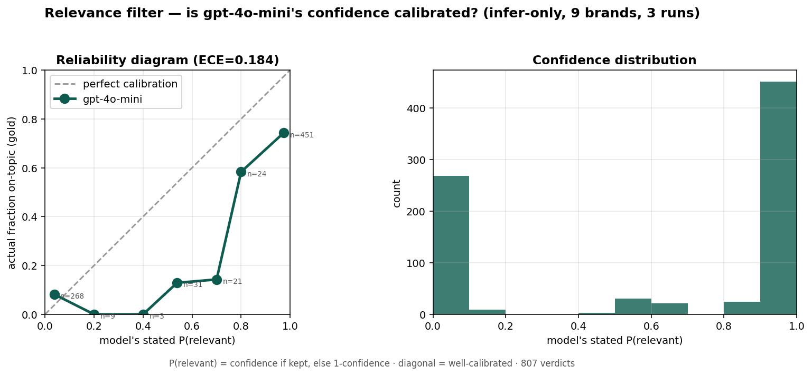

# Topic relevance filter — confidence & the `--min-confidence` dial

When an LLM key is set, `track` classifies each keyword match as on-topic vs
off-topic and stores a soft verdict on the `topicpost` row: `relevant` (tri-state),
`relevance_confidence` (0–1), plus reason/model/at. Downstream surfaces hide only
posts judged `False` (see `relevant_clause`); nothing is deleted.

## Is the confidence meaningful?



Reliability diagram over the eval gold (gpt-4o-mini, infer-only): **the model is
systematically overconfident** — the curve sits below the diagonal (it claims
~0.95 P(relevant) where reality is ~0.74), ECE ≈ 0.18, and confidence is bimodal
(mostly ~0 or ~1). So treat the number as a coarse signal, not a probability.

**But the drop side is well-ordered:** confident drops (P(relevant) ≈ 0) are ~92%
truly off-topic. So gating *hiding* by confidence is defensible — a high threshold
reliably keeps only the sure junk hidden and surfaces the model's unsure calls.

## The dial

`page --min-confidence <0–1>` hides an off-topic post only when the model was at
least that confident; lower-confidence drops stay visible. Default `0` hides every
`False` (unchanged). It threads through `relevant_clause(min_confidence)` →
`topic_posts`/`topic_comments` → `render_topic_page`.

```
redlens page monday                       # hide all flagged off-topic (default)
redlens page monday --min-confidence 0.9  # only hide drops the model was ≥0.9 sure of
```

Reproduce the chart: the eval harness lives at `~/Dropbox/6-Studio/redlens/filter-eval/`
(out of tree); it logs `(confidence, gold)` per verdict for the reliability diagram.
